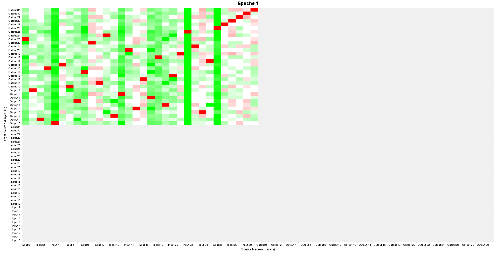
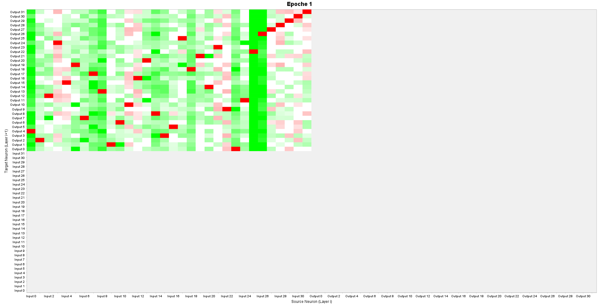

# Aufgaben der Praxisphase

## A.2: Implementierung - Kryptoanalyse

Nach der ersten Betrachtung der beiden Unteraufgaben fiel die Auswahl in unserem Fall (KNN) sehr schnell auf A.2.2.
Für das Training eines neuronalen Netzes benötigen wir unter anderem einen Datensatz mit Eingaben sowie dazugehörigen erwarteten/korrekten Ausgaben (Supervised Learning).
Da A.2.1 keinen solchen Datensatz bereitstellt, eignet sich hierfür der Einsatz eines neuronalen Netzes schlecht.
A.2.2 bietet jedoch einen solchen Datensatz für Supervised Learning, weshalb hier uns sehr eindeutig für A.2.2 entschieden haben.

### A.2.2: Monoalphabetische Substitution 2

#### Vorbereitung des Datensatzes
Bevor das neuronale Netz trainiert werden kann, muss der Datensatz zunächst aufbereitet werden.
Da es sich um eine monoalphabetische Substitution handelt, muss jeder Buchstabe (wie bereits in der Aufgabe gefordert) einzeln betrachtet werden.
Es wird demnach als Eingabe sowie Ausgabe jeweils ein einzelner Buchstabe (bzw. Zeichen) verwendet.
Hier gibt es jedoch theoretisch mehrere Möglichkeiten der Codierung.

So könnte z.B. ein Input-/Output-Neuron verwendet werden, das das Zeichen in ASCII-Codierung (0-255) erhält/ausgibt.
Diese Wahl funktionierte praktisch jedoch sehr schlecht, da eine solche Funktion (Funktion = trainiertes Modell) wesentlich komplexer ist und bei kleinen Abweichung bereits falsche Übersetzungen liefern kann.

Sinnvoller ist es hingegen, jedes Zeichen als eigenes "Feature" bzw. Input-/Output-Neuron darstellen.
Dafür ist insbesondere die One-Hot-Codierung, für die wir uns schließlich entschieden haben, ideal geeignet.
Um die Anzahl der nicht verwendeten Neuronen zu reduzieren haben wir für die One-Hot-Codierung zunächst ein Alphabet mit allen im Klar-/Geheim-Text enthaltenen Zeichen erstellt: ` abcdefghijklmnopqrstuvwxyz ,:;-.`.
a entspricht also dem Input-Vektor `1000...`, b entspricht `0100...`, usw.

#### Struktur des neuronalen Netzes
Es gibt wie auch bei der Codierung verschiedene Möglichkeiten, das Netz aufzubauen.
Unsere KNN-Implementierung unterstützte bis vor kurzem keine Netzstrukturen ohne Hidden Layer, weil wir hierfür bisher keine Notwendigkeit gesehen hat.
Bei der monoalphabetischen Substitution war es jedoch sehr sinnvoll, auf den Hidden Layer zu verzichten, da im Idealfall jeweils ein Input-Neuron nur genau eine starke Verbindung zu einem Output-Neuron haben soll.
Das hatte zur Folge, dass wir zunächst die monoalphabetische Substitution mit Hidden Layer implementiert haben.
Anschließend haben wir unsere KNN-Implementierung angepasst, um auf den Hidden Layer verzichten zu können.

#### Basis-Implementierung (Verlustfunktion & Aktivierungsfunktionen)
Beide Implementierungen (mit/ohne Hidden Layer) setzen für die Verlustfunktion auf `Binary Cross-Entropy Loss`.
Diese Verlustfunktion ist eigentlich für Klassifikationen mit voneinander unabhängigen Klassen geeignet.
Auch wenn die Klassen hier nicht voneinander unabhängig sind (exklusive Klassen: a schließt b aus, etc.), hat die Klassifizierung dennoch sehr gut funktioniert.
Als Aktivierungsfunktion der Output-Neuronen haben wir die Sigmoid-Funktion verwendet, für die die gleiche Einschränkung wie für den `Binary Cross-Entropy Loss` gilt.

Zukünftig wäre es für solche Klassifizierungsprobleme mit voneinander abhängigen (z.B. exklusiven) Klassen sinnvoll, als Verlustfunktion auf den `Categorical Cross-Entropy Loss` in Kombination mit der Softmax-Aktivierungsfunktion im Output-Layer zu setzen.
Dies hätte jedoch einen höheren Implementierungsaufwand zur Folge, weshalb bei der aktuell funktionierenden Implementierung zunächst auf einen Workaround gesetzt wird.
Die Klasse mit der höchsten Output-Neuron-Aktivierung (nahe 1) wird als korrekte Klasse interpretiert.
Das hat beim vorhandenen Datensatz sehr gut funktioniert, kann bei anderen komplizierteren Datensätzen jedoch scheitern, da diese Werte nicht normalisiert und damit eigentlich nicht untereinander vergleichbar sind.

#### Implementierung mit Hidden Layer
Der Hidden Layer wurde mit verschiedenen Aktivierungsfunktionen implementiert, die sich als unterschiedlich effizient erwiesen haben.
Aufgefallen ist dabei, dass
1. bei steigender Anzahl an Neuronen im Hidden Layer weniger Trainings-Epochen benötigt wurden bzw.
2. bei steigender Anzahl an Trainings-Epochen weniger Neuronen im Hidden Layer benötigt wurden,
3. je nach Aktivierungsfunktion mehr/weniger Neuronen im Hidden Layer oder Trainings-Epochen benötigt wurden.

Die minimal benötigten Trainings-Epochen bei 10, 15, 20 und 50 Neuronen im Hidden Layer waren mit der Learning Rate 0.1 und Seed 42 (Gewichtsinitialisierung Glorot Uniform) in unserer Implementierung für diesen Datensatz folgende:

| Aktivierungsfunktion | Neuronen im Hidden Layer | Trainings-Epochen  |
|------------------|--------------------------|--------------------|
| Snake            | 10                       | 23                 |
| Snake            | 15                       | 10                 |
| Snake            | 20                       | 9                  |
| Snake            | 50                       | 5                  |
|                  ||                    |
| ReLU             | 10                       | 32                 |
| ReLU             | 15                       | 18                 |
| ReLU             | 20                       | 16                 |
| ReLU             | 50                       | 7                  |
|                  ||                    |
| Swish            | 10                       | 26                 |
| Swish            | 15                       | 18                 |
| Swish            | 20                       | 16                 |
| Swish            | 50                       | 11                 |

Im Hidden Layer sind von den in unserer Implementierung vorhandenen Aktivierungsfunktionen eher nur diese 3 Aktivierungsfunktionen sinnvoll (statt z.B. einer Sigmoid-Funktion wie im Output-Layer bei einer Klassifikation).
Dabei ist aber auffällig und unerwartet, dass insbesondere die für periodische Daten geeignete Snake-Aktivierungsfunktion in jedem getesteten Fall besser war als die häufig verwendete ReLU-Funktion oder die darauf aufbauende Swish-Funktion.

Aufgrund dieser Ergebnisse fällt die Wahl der Aktivierungsfunktion auf die Snake-Funktion im Hidden Layer.
Hier ist auch die Verwendung von 15 Neuronen eine möglichst geringe Anzahl, die die Anzahl der Trainings-Epochen nicht zu sehr erhöht.

#### Implementierung ohne Hidden Layer

Die Implementierung ohne Hidden Layer ist wesentlich einfacher und liefert direkt mit einer hohen Learning-Rate von 10 (führt mit Hidden Layer sofort zu NaN-Loss) nach nur einer Trainings-Epoche ein funktionierendes Modell zur Verschlüsselung sowie Entschlüsselung.
Dieses kann als Heatmap sogar sehr gut und menschenlesbar dargestellt werden:

Verschlüsselung:

Entschlüsselung:

Der Index des Input-/Output-Neurons entspricht dem Index der Zeichens im gewählten Alphabet.
Man sieht sogar sehr gut, dass alle Sonderzeichen (jeweils oben rechts) auf sich selbst abgebildet werden.