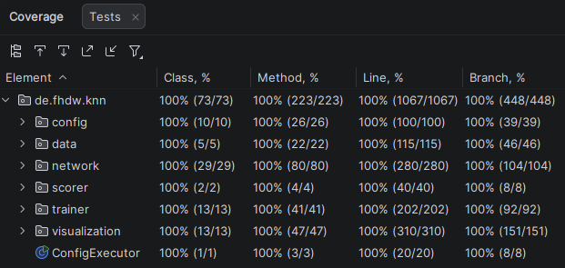

Dokumentation: <strong><i>[README.md](README.md)</strong></i> - [library.md](docs/library.md) - [configuration.md](docs/configuration.md)

# KNN

Dokumentation zur KNN-Bibliothek von Team C (Marcel Anker, Lennart Heinrich, Piet Ostendorp).
Hier wird die grundlegende Dokumentation anhand von Beispielen erklärt.
Detaillierte Informationen zu einzelnen Klassen bzw. Interfaces sind der
beiliegenden [Javadoc](docs/javadoc/de/fhdw/knn/package-summary.html) zu entnehmen.
Ein grober [Überblick](#überblick) über die Funktionalität der Bibliothek ist ebenfalls weiter unten zu finden.

## Was ist dieses Projekt?

Dieses Projekt ist eine selbst geschriebene Machine-Learning Bibliothek zum
Erstellen und Trainieren von KNNs (künstlichen Neuronalen Netzen). Es umfasst
das Erstellen von neuronalen Netzen mit und ohne Hidden-Layer, verschiedene
Aktivierungs-, Verlust- und Optimierungsfunktionen, einstellbare Trainingsparameter,
Visualisierungsmethoden der KNNs und die Möglichkeit, Dateien einzulesen.

## Verwendung der Konfiguration

Die Verwendung von TOML-Konfigurationsdateien ist unter [docs/configuration.md](docs/configuration.md) beschrieben.

## Verwendung der Bibliothek

Die Verwendung dieses Projekts als Bibliothek ist unter [docs/library.md](docs/library.md) beschrieben.

## Überblick

### Funktionalität / Umsetzung

Die Funktionalität der KNN-Bibliothek umfasst die Erstellung und das Training von künstlichen Neuronalen Netzen (KNNs)
mit verschiedenen Konfigurationen. Es ermöglicht die Auswahl von Aktivierungsfunktionen, Verlustfunktionen und
Optimierungsalgorithmen, um die Leistung der KNNs zu optimieren. Die Bibliothek bietet auch Möglichkeiten zur
Visualisierung der KNN-Struktur und der Trainingsfortschritte.

- <strong>Daten-Verarbeitung</strong>
    - CSV-Dateien einlesen (inkl. Preprocessing)
    - Abstraktion der Daten durch die `DataSet`-Klasse
    - Normalisierung der Daten (z.B. `MinMaxNormalizer`)
    - Train-/Test-Split der Daten

- <strong>Konfigurierbare Netzwerk-Strukturen</strong>
    - Feedforward Neural Network
    - erweiterbare Aktivierungsfunktionen: ReLU, Swish, Sigmoid, Snake, Softplus, Tanh, Linear, Sinus
    - erweiterbare Gewichtsinitialisierungen: Glorot/Xavier (Normal, Uniform), He (Normal, Uniform), Zero
    - Flexible Anzahl Neuronen im Input Layer
    - Flexible Anzahl Dense Layer mit konfigurierbarer Anzahl Neuronen
        - Verzicht auf Hidden Layer möglich
        - Hilfsmethoden zum Einfachen erstellen mehrere Dense Layer (üblicher Strukturen)
    - verschiedene Neuronen-Arten: Input Neuronen, Dense Neuronen, Super Neuronen
        - Integration komplexer Strukturen in einzelne Neuronen möglich (Super Neuronen)
        - Super Neuronen können als Container für Subnetze dienen (mit Adapter für die Integration in das Hauptnetz)
        - Unterstützung von Verbindungs-Gewichten und -Guards sowie Bias und Aktivierungsfunktionen

- <strong>Konfigurierbare Trainings-Parameter</strong>
    - erweiterbare Verlustfunktionen: Mean Squared Error (MSE), Mean Absolute Error (MAE),
      Binary Cross-Entropy Loss (BCE)
    - erweiterbare Learning Rates: konstant, exponentiell abnehmend (Decay), gedämpfter Start (Softstart),
      SoftstartDecay (kombiniert)
    - erweiterbare Optimierungs-Algorithmen: Gradient Descent
        - Backpropagation auf Basis analytisch berechneter Gradienten
    - erweiterbare Stop-Funktionen: Early Stopping
        - basierend auf Verlustfunktion
    - konfigurierbare Anzahl Epochen und Batch-Größe (z.B. Mini-Batching oder SGD)
        - parallelisiertes Batch-Training (Multi-Threading) für große Batch-Größen
    - dynamischer Export während des Trainings (z.B. alle n Epochen)
    - Visualisierung des Netzes während des Trainings
    - randomisierter Shuffle der Tranings-Daten (mit Seed für Reproduzierbarkeit)

- <strong>Modell-Export/Import</strong>
    - Export von trainierten Modellen in Dateien
        - kompaktes/effizientes Format (binär)
    - Import von Modellen aus Dateien
    - Export/Import inklusive Subnetzen (z.B. Super Neuronen)
        - Export und Import erzeugen 100% identisches Modell

- <strong>Evaluierung</strong>
    - Evaluierung der Modell-Performance auf Testdaten
        - erweiterbare Scorer: Classification Scorer (für Klassifikationsprobleme)
    - Berechnung der True/False Positives/Negatives
    - Berechnung von Metriken wie Accuracy, Error, Precision, Recall, F1-Score

- <strong>Visualisierung</strong>
    - Visualisierung der KNN-Struktur (Verbindungen/Gewichte zwischen Neuronen)
        - auch live während des Trainings möglich (z.B. alle n Epochen)
    - Heatmap der Gewichte
    - Sankey-Plot der Verbindungsstärken

- <strong>Bibliothek oder TOML-Config</strong>
    - programmatische Erstellung von KNNs über die Java-API
        - erweiterter Funktionsumfang (z.B. durch Implementierung von Interfaces)
        - volle Kontrolle inklusive Pre-/Post-Processing
    - deklarative Erstellung häufiger Anwendungsfälle über TOML-Konfigurationsdateien
        - Daten-Verarbeitung
        - Netzwerk-Struktur
        - Trainings-Parameter
        - Export/Import
        - Evaluierung
        - Visualisierung

### Flexibilität / Interoperabilität

- <strong>Anwendung auf verschiedene Datensätze und Problemstellungen</strong>
    - z.B. Regression, Klassifikation, Monoalphabetische Substitution
    - keine Einschränkung auf bestimmte Problemstellungen
    - flexible Konfiguration der Netzwerk-Struktur und Trainings-Parameter ermöglicht Anpassung an verschiedene
      Anwendungsfälle

- <strong>Erweiterbarkeit durch Implementierung definierter Interfaces</strong>
    - Normalizer
    - Aktivierungsfunktionen
    - Gewichtsinitialisierungen
    - Optimierungsalgorithmen
    - Verlustfunktionen
    - Stop-Funktionen
    - Learning-Rate-Funktionen
    - Scorer
    - individuelle Dense Neuronen (nur bei Erweiterung des Optimierungsalgorithmus)

### Effizienz / Performance

- Multithreading für Batch-Training
  - Parallelisierung der Backpropagation
  - Parallelisierung der Netzwerk-Anpassung
- effiziente Wiederverwendung allokierter Arrays
  - Ziel: Zero-Allocation (Heap) während des Trainings
  - Arrays für Anpassungen/Adjustments nur zu Beginn allokieren und wiederverwenden
    - Performance-Verbesserung um ca. 30%
    - stabile Speicherauslastung (Entlastung des Garbage Collectors)
  - Neuron-Ausgabe in wiederverwendbarem Buffer
  - Optimierungsalgorithmus während Trainings-Epoche stateless und thread-safe
    - Multithreading trotz wiederverwendeter Buffer
- Parallelisierung des Feedforward bei Vorhersage für große DataSets
  - Netzwerk ist während Feedforward stateless und thread-safe
- Vergleichbare Performance wie scikit-learn je nach Trainings-Parametern
  - schneller für kleine Batch-Größen (z.B. SGD)
    - Batch-Größe 1: `23.78s` (KNN-Bibliothek) vs. `175.51s` (scikit-learn)
    - Batch-Größe 4: `26.25s` (KNN-Bibliothek) vs. `45.47s` (scikit-learn)
    - Batch-Größe 8: `19.67s` (KNN-Bibliothek) vs. `23.98s` (scikit-learn)
    - Batch-Größe 16: `14.16s` (KNN-Bibliothek) vs. `13.19s` (scikit-learn)
    - Batch-Größe 32: `12.93s` (KNN-Bibliothek) vs. `7.54s` (scikit-learn)
    - Batch-Größe 64: `12.45s` (KNN-Bibliothek) vs. `5.23s` (scikit-learn)
  - Beispiel für die Messung: Konfiguration `conf/bq_perf.toml`
    - CPU: AMD Ryzen 5 3600 (6 Kerne, 4.2 GHz)
    - scikit-learn siehe [docs/assets/bq_perf.py](docs/assets/bq_perf.py)

### Dokumentation

Eine ausführliche Dokumentation zu diesem Projekt ist in drei Teilen verfügbar:

- TOML-Konfigurationsdateien: [docs/configuration.md](docs/configuration.md)
- Java-Bibliothek (grundlegend): [docs/library.md](docs/library.md)
- Javadoc (detailliert): [docs/javadoc](docs/javadoc/de/fhdw/knn/package-summary.html)

### Testvolumen

Zur Sicherstellung der Qualität und Stabilität des Codes wurden umfangreiche Tests zum Erreichen einer Branch (und Line)
Coverage von 100% implementiert (ausgenommen davon sind lediglich die experimentellen und isolierten Klassen im Package
`de.fhdw.knn.run`).
Um darüber hinaus die Testabdeckung weiter zu erhöhen, wurden nach Erreichen der Branch Coverage von 100% zusätzlich
Tests automatisiert generiert (z.B. mithilfe von GitHub Copilot).
Diese generierten Testfälle wurden manuell überprüft und anschließend mit der Annotation `@Generated` gekennzeichnet,
um sie von manuell erstellten Tests zu unterscheiden und das verwendete Tool anzugeben.

- manuell erstellte Tests zur Abdeckung aller wichtigen Anwendungsfälle und Randfälle
    - 100% Branch Coverage (experimentelles Package `de.fhdw.knn.run` ausgenommen)
    - 100% Line Coverage (experimentelles Package `de.fhdw.knn.run` ausgenommen)
- manuell überprüfte, automatisiert generierte Tests (mit `@Generated`-Annotation) zur Erhöhung der Testabdeckung
- Durchführung von Regressionstests nach Code-Änderungen
- <strong>264 Testfälle</strong> insgesamt
- <strong>Coverage Report</strong> siehe [docs/test_coverage](docs/test_coverage/index.html)

