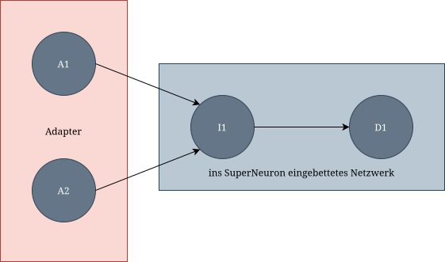
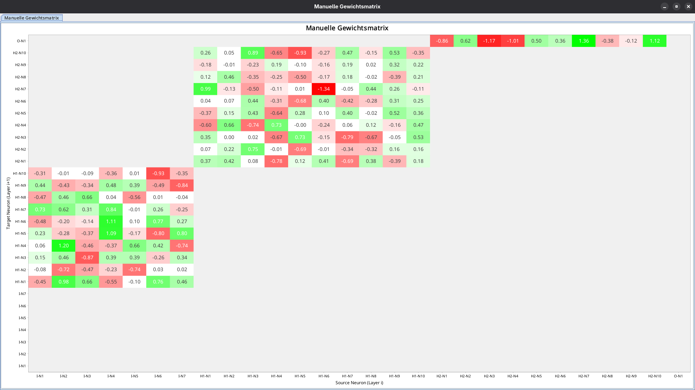
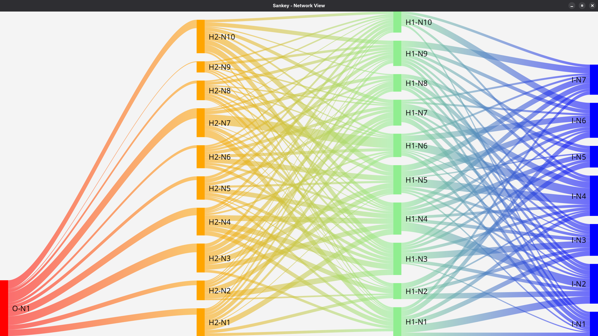

Dokumentation: [README.md](../README.md) - <strong><i>[library.md](library.md)</strong></i> - [configuration.md](configuration.md)

# Verwendung der Bibliothek

Im folgenden Abschnitt wird die Verwendung der Bibliothek am Beispiel eines Datensatzes zur Klassifikation der Bananen-Qualität schrittweise vorgestellt.
Zunächst wird der gesamte Code gezeigt, um einen Überblick zu geben.
Anschließend werden die einzelnen Schritte und weitere Funktionen der KNN-Bibliothek detailliert erläutert.

## Beispiel-Code

Vollständige/ausführbare Klasse für dieses Beispiel siehe `de.fhdw.knn.run.BananaQuality`

```java
package de.fhdw.knn.run;

import de.fhdw.knn.scorer.ClassificationScorer;
import de.fhdw.knn.data.CsvReader;
import de.fhdw.knn.data.DataSet;
import de.fhdw.knn.data.TrainTestSplit;
import de.fhdw.knn.network.Network;
import de.fhdw.knn.network.activation.ActivationFunction;
import de.fhdw.knn.network.connection.WeightInitializer;
import de.fhdw.knn.network.layer.DenseLayer;
import de.fhdw.knn.trainer.Trainer;
import de.fhdw.knn.trainer.learningrate.ConstantLearningRate;
import de.fhdw.knn.trainer.loss.LossFunction;
import de.fhdw.knn.trainer.optimization.GradientDescent;
import de.fhdw.knn.trainer.optimization.OptimizationFunction;
import de.fhdw.knn.trainer.stop.EarlyStopping;
import de.fhdw.knn.trainer.stop.StopFunction;
import de.fhdw.knn.visualization.HeatmapData;
import de.fhdw.knn.visualization.HeatmapView;
import java.io.IOException;

public class BananaQuality {
    public static void main(String[] args) throws IOException {
        /// Datenaufbereitung
        DataSet data = CsvReader.readFile("data/banana_quality.csv", 0, 7, 7, 1);
        /// optional Inputs (oder Outputs) normalisieren
        // MinMaxNormalizer data = new MinMaxNormalizer(-10, 10);
        // train.normalizeInputs(data);

        /// Train-/Test-Split erzeugen
        TrainTestSplit trainTest = data.shuffleAndSplit(42, 0.2);
        DataSet train = trainTest.train;
        DataSet test = trainTest.test;


        /// Netzwerk erzeugen
        DenseLayer[] denseLayers = DenseLayer.createLayers(
                ActivationFunction.SWISH, ActivationFunction.SIGMOID,
                100, 100, 1);
        Network network = new Network(42, WeightInitializer.GLOROT_UNIFORM,
                7, denseLayers);
        /// alternativ vorhandenes Netzwerk importieren
        // network = Importer.importNetwork("models/bq.knn");

        /// Loss-, Stop- und Optimization-Funktion für das Training festlegen
        LossFunction lossFunction = LossFunction.CROSS_ENTROPY_LOSS;
        StopFunction stopFunction = new EarlyStopping(0.002, 5);
        LearningRateFunction learningRateFunction = new ConstantLearningRate(0.03);
        OptimizationFunction optimizationFunction = new GradientDescent(lossFunction, learningRateFunction);

        /// Trainer mit Mini-Batching definieren und starten
        Trainer trainer = new Trainer(network, 30, true, 10,
                lossFunction, stopFunction, optimizationFunction);
        trainer.train(train);

        /// Evaluierung des trainierten Netzwerks
        Scorer scorer = new ClassificationScorer(Vollständiger network);
        Score score = scorer.score(test);
        score.print();

        /// optionaler Export des Netzwerks
        // network.export("models/bq_demo.knn");

        /// Visualisierung des Netzwerks als Heatmap
        HeatmapData heatmapData = new HeatmapData(network);
        HeatmapView window = new HeatmapView();
        window.addHeatmap(heatmapData, "Manuelle Gewichtsmatrix");

        /// Visualisierung des Netzwerks als Sankey-Plot
        try {
            Platform.startup(() -> {
            }); // JavaFx initialisieren
        } catch (IllegalStateException ignored) {
        } // Ignorieren, falls es schon läuft
        new SankeyView(network, "Manueller Sankey-Plot");
    }
}
```

Weitere Code-Beispiele, die während der Entwicklung erstellt wurden und nicht dokumentiert sind, befinden sich ebenfalls in demselben Package `de.fhdw.knn.run`

## Datenaufbereitung

### CsvReader

Mit dem CSV-Reader ist es möglich, CSV-Dateien in ein `DataSet` umzuwandeln. Hier muss einmal der
Dateipfad und jeweils der Startindex und die größe des Inputs und Outputs angegeben werden.
In der nun vorliegenden Form sind die Daten dann bereit, in Train und Test-Splits aufgeteilt zu werden.
Dabei kann ein Random-Seed und den Anteil der Daten im Test-Set angegeben werden.
```java
DataSet data = CsvReader.readFile("data/banana_quality.csv", 0, 7, 7, 1);
TrainTestSplit trainTest = data.shuffleAndSplit(42, 0.2);
DataSet train = trainTest.train;
DataSet test = trainTest.test;
```
### DataSet

Als Rückgabe erhält man ein `DataSet`, welches man sich wie ein klassisches Tabellenobjekt für
maschinelles Lernen vorstellen kann. Es enthält alle Eingabewerte und zugehörigen
Ausgabewerte in Form von zweidimensionalen Arrays, wobei jede Zeile einem einzelnen
Datenpunkt entspricht. Zusätzlich speichert es Metainformationen wie die Anzahl der Datensätze
sowie die Anzahl der Ein- und Ausgabewerte pro Zeile. Darüber hinaus stellt die Klasse Methoden
zur Vorverarbeitung bereit, etwa zum Mischen der Daten, Aufteilen in Trainings- und Testdaten
oder zur Normalisierung.

### Normalizer

Der Normalizer dient dazu, Eingabe- oder Ausgabedaten vor dem Training auf einen
einheitlichen Wertebereich zu skalieren. Dadurch werden unterschiedliche Größenordnungen
der Features ausgeglichen, was die Stabilität und Konvergenz des Lernalgorithmus verbessert.
Der verwendete Normalizer speichert dabei die berechneten Parameter, sodass die Daten bei Bedarf wieder
denormalisiert werden können. `MinMaxNormalizer` orientiert sich dabei an den Min- und Max-Werten
der Daten. Bei Bedarf lassen sich weitere Normalizer unter Implementierung des `Normalizer`-Interfaces
implementieren. Weitere Informationen dazu sind in den Java-Docs zu finden.

```java
data.normalizeInputs(normalizerInputs);
data.normalizeInputs(normalizerOutputs);
```

## Network

Die Netzstruktur wird in der Network-Klasse aufgebaut. Sie setzt sich aus einem Input-Layer (`7` gibt hier die Anzahl der Input-Neuronen im Layer an)
mehreren Dense-Layern (`denseLayers` siehe unten), einem Random-Seed (`42`) und einem sog. Weight-Initializer zusammen.
Da die Erzeugung der Dense-Layer nicht trivial mit der Anzahl der Layer/Neuronen möglich ist, wird hierauf in einem gleich folgenden Abschnitt eingegangen.
Jedes erstellte Network ist ein fully-connected Feed-Forward-Network.
```java
Network network = new Network(42, WeightInitializer.GLOROT_UNIFORM, 7, denseLayers);
```

### Weight-Initializer

Bei Erstellung eines Networks müssen am Ende die Gewichte der vorher definierten Kanten initialisiert
werden. Dafür werden diese Weight-Initializer im Network angegeben. Zu den zur Verfügung stehenden
Initializern gehören:
- `WeightInitializer.ZERO`
- `WeightInitializer.HE`
- `WeightInitializer.HE_UNIFORM`
- `WeightInitializer.GLOROT`
- `WeightInitializer.GLOROT_UNIFORM`

### Input-Layer

Der Input-Layer besteht aus mehreren Input-Neuronen. Er ist so wie ein klassischer Input-Layer
zu verstehen. Es gibt keine weiteren Parameter.

### Dense-Layer

Der Dense-Layer bildet sowohl die Hidden-Layer als auch den Output-Layer eines neuronalen Netzes
ab. Bei der Erstellung werden zwei Aktivierungsfunktionen benötigt. Die Erste ist für jeden Hidden-Layer.
Die Zweite ist für den Output-Layer, da es sich als hilfreich erwiesen hat, diese zu unterscheiden.
Zusätzlich wird eine beliebige Anzahl von Integer-Werten übergeben, die jeweils die Anzahl der Neuronen pro Schicht
festlegen. Jeder dieser Integer-Werte steht für eine eigene Schicht im Netzwerk, wobei der
letzte Wert die Größe des Output-Layers bestimmt.

Alternativ kann das Array der Dense-Layer auch manuell mit beliebigen Neuronen und Aktivierungsfunktionen erstellt werden.
Die übergebenen Neuronen der DenseLayer werden vom Konstruktor der Netzwerk-Klasse automatisch verbunden (fully-connected, Feed-Forward).

Bei Bedarf können weitere Akivierungsfunktion unter Implementierung des `ActivationFunction`-
Interfaces eingebaut werden. Weitere Informationen sind in den Java-Docs zu finden.

```java
DenseLayer[] denseLayers = DenseLayer.createLayers(ActivationFunction.SWISH, ActivationFunction.SIGMOID, 100, 100, 1);
```
Zu den unterstützten Aktivierungsfunktionen gehören:

- `ActivationFunction.LINEAR`
- `ActivationFunction.RELU`
- `ActivationFunction.SIGMOID`
- `ActivationFunction.SIN`
- `ActivationFunction.SNAKE`
- `ActivationFunction.SOFTPLUS`
- `ActivationFunction.SWISH`
- `ActivationFunction.TANH`

### Neuronen

Diese Bibliothek liefert verschiedene Neuronen, welche zur Erstellung von
KNNs verwendet werden können.
- `InputNeuron`: Neuronen des Input-Layers (ohne weitere Funktion/Parameter)
- `AbstractDenseNeuron`: Hat als abstrakte Klasse der Neuronen im Dense-Layer mehrere eingehende `Connection`s (aus allen Neuronen des vorherigen Layers, jeweils mit Gewicht) und kann eine Ausgabe/Aktivierung berechnen.
- `DenseNeuron`: Spezialisierung des `AbstractDenseNeuron` mit Bias und Aktivierungsfunktion. Verhält sich wie ein klassisches künstliches Neuron.
- `SuperNeuron`: Spezialisierung des `AbstractDenseNeuron`, welches ein ganzes anderes importiertes `Network` beinhaltet. Somit verhält sich dieses Neuron wie dieses Network und ist nicht von der Optimierungsfunktion des Hauptnetzwerks betroffen.

Bei Bedarf können weitere Neuronen unter Berücksichtigung des `AbstractDenseNeuron`s implementiert werden.
Weitere Informationen finden sich in den Java-Docs.

#### SuperNeuron-Adapter

Zur Erzeugung eines `SuperNeuron`s kann zusätzlich ein Adapter verwendet werden, wenn
- die Anzahl der Input-Neuronen des Netzwerks innerhalb des `SuperNeuron`s von der Anzahl der Neuronen im Layer vor dem `SuperNeuron` abweicht,
- oder nicht nur genau jedes n-te Neuron des vorherigen Layers mit jedem n-ten Input-Neuron des Netzwerks innerhalb des `SuperNeuron`s verbunden werden soll

Mithilfe des Adapters wird ein weiterer Input-Layer innerhalb des Netzwerks im `SuperNeuron` erzeugt.
Der Adapter-Bias gibt den Bias für jedes Neuron des ursprünglichen Input-Layers vom eingebetteten Netzwerk an.
Dieser ursprüngliche Input-Layer wird nun zum intern zum ersten Dense-Layer und benötigt also nun einen Bias.

Die Adapter-Weights geben nun die Verbindungen in den ursprünglichen Input-Layer (nun ersten Dense-Layer) vom neuen Input-Layer an.
Das zweidimensionale/äußere Array fasst alle Neuronen des ursprünglichen Input-Layers zusammen.
Das n-te innere Array im äußeren Array beschreibt alle eingehenden Verbindung aus dem neuen Input-Layer in das n-te Neuron des ursprünglichen Input-Layers.
Das m-te Element im n-ten inneren Array gibt die Verbindung vom m-ten Neuron des neuen Input-Layers zum n-ten Neuron des ursprünglichen Input-Layers an.

Das erzeugte Super-Neuron (z.B. mit Adapter) kann anschließend in ein anderes Netzwerk mit Angabe von Layer und Neuron-Index eingefügt werden (`insert`).

```java
Network includedNetwork = Importer.importNetwork("models/sin_snake.knn");
double[] adapterBias = new double[]{0};
double[][] adapterWeights = new double[][]{
        new double[]{1}
};
SuperNeuron superNeuron = new SuperNeuron(includedNetwork, adapterBias, adapterWeights);
superNeuron.insert(network, 0, 0);
```

Hat das äußere Netzwerk vom oberen Beispiel abweichend z.B. 2 Neuronen in dem Layer, das dem Super-Neuron direkt vorgelagert ist, und das eingebettete Netzwerk nur ein Neuron im Input-Layer, muss folgender Adapter verwendet werden:



A1 und A2 sind die neu hinzugefügten Adapter-Neuronen, die nun neu hinzugefügten Input-Layer des Netzwerks innerhalb des Super-Neurons liegen.
I1 ist das Neuron des ursprünglichen Input-Layers des eingebetteten Netzwerks, welches nun zum ersten Dense-Layer wird.
D1 befindet sich nun im zweiten Dense-Layer (ursprünglich erster Dense-Layer).
Hier beschreibt `adapterBias[0]` den Bias von I1, `adapterWeights[0][0]` das Gewicht von A1 zu I1 und `adapterWeights[0][1]` das Gewicht von A2 zu I1.
Entsprechend kann der Adapter z.B. wie folgt definiert werden:
```java
double[] adapterBias = new double[]{
        7 // Bias von I1
};
double[][] adapterWeights = new double[][]{
        new double[]{ // beschreibt alle eingehenden Verbindung zu I1
                10, // Gewicht der Verbindung von A1 zu I1
                5 // Gewicht der Verbindung von A2 zu I1
        };
};
```

### IO

Es besteht auch die Möglichkeit, bestehende Networks zu exportieren und diese dann an anderen Stellen
wieder zu importieren. Exportiert wird in ein binäres Format, da es viel kompakter ist, als ein
menschenlesbares Format.

```java
Network networkToExport = ...
networkToExport.export("models/bq.knn");
Network importedNetwork = Importer.importNetwork("models/bq.knn");
```

## Trainer

Der Trainer ist die Klasse, welche das Training ausführt. Für das Training
muss mehrere Parametern angegeben werden:
- `Network`, auf dem trainiert wird,
- die maximale Anzahl an `Epchen` als Integer,
- ein Boolean, ob ge`shuffle`t werden soll,
- die `Batch-Size` (z.B. für Mini-Batching, deaktiviert wenn `1`),
- die `Verlust-Funktion` zum Ermitteln Qualität des Netzwerks nach jeder Epoche (wird nur zur Ausgabe verwendet, nicht zum Training: `null` zum Deaktivieren),
- die `Stop-Methode` kann das Training vorzeitig beenden,
- und die `Optimierungsfunktion` ermitteln die Anpassungen des Netzwerks (in der Regel `GradientDescent`, in welchem die tatsächlich zum Training genutzte Verlust-Funktion definiert wird, die von der Verlust-Funktion des Trainers abweichen kann)
```java
LossFunction lossFunction = LossFunction.CROSS_ENTROPY_LOSS;
StopFunction stopFunction = StopFunction.NEVER;
OptimizationFunction optimizationFunction = new GradientDescent(lossFunction, new ConstantLearningRate(0.03));

Trainer trainer = new Trainer(network, 50, true, 1, lossFunction, stopFunction, optimizationFunction);
trainer.train(train);
```

### Learning-Rate

Für die Steuerung der Learning-Rate stehen mehrere Strategien zur Verfügung,
die das Trainingsverhalten des Modells beeinflussen. Zur Auswahl gehören `Constant`, `Decay`,
`Softstart` sowie `SoftstartDecay`.

Bei `Constant` bleibt die Lernrate während des gesamten Trainingsprozesses unverändert.
`Decay` reduziert die Lernrate exponentiell über die Trainingszeit hinweg, um gegen Ende
stabilere und feinere Anpassungen der Gewichte zu ermöglichen. `Softstart` beginnt mit einer
zunächst kleinen Lernrate, die in den ersten Trainingsepochen um einen konstanten Faktor begrenzt wird, um
ein zu starkes initiales Überschwingen zu vermeiden. `SoftstartDecay` kombiniert beide Ansätze,
indem die Lernrate zunächst begrenzt wird (`Softstart`) und anschließend im weiteren Verlauf wieder
kontinuierlich abgesenkt wird (`Decay`).

Weitere Learningrates können unter Berücksichtigung des `LearningRateFunction`-Interfaces
implementiert werden. Weitere Details sind in den Java-Docs zu finden.

### Loss-Function

Bei einem KNN mit dem Gradient-Descent-Optimierungsalgorithmus wird in der Regel eine Verlust-Funktion verwendet,
um einerseits die Modellqualität messbar beurteilen zu können
und andererseits die Anpassungen/Optimierungen des Netzwerks von dieser Funktion beeinflussen zu lassen.

Die im Folgenden definierte Verlustfunktion kann also einerseits im Trainer zur Ausgabe der Qualität (kleiner Loss) verwendet werden
und andererseits in der Optimierungsfunktion `GradientDescent`, um tatsächlich das Modell mit dieser zu trainieren (beide Angaben können abweichen).

```java
LossFunction lossFunction = LossFunction.CROSS_ENTROPY_LOSS;
```
Diese Bibliothek unterstützt klassische Verlust-Funktionen:

- `LossFunction.CROSS_ENTROPY_LOSS` (entspricht Binary Cross-Entropy Loss)
- `LossFunction.MEAN_SQUARED_ERROR`
- `LossFunction.MEAN_ABSOLUTE_ERROR`

Bei Bedarf können unter Implementierung des `LossFunction`-Interfaces weitere Loss-Funktionen
hinzugefügt werden. Weitere Informationen sind in den Java-Docs zu finden.

### Stop-Criteria

Diese Bibliothek unterstützt außerdem das `EarlyStopping`, um Overfitting vorzubeugen.
Diese Stop-Funktion muss beim Erstellen des Trainers mitgegeben werden. Bislang kann man
nur Early-Stopping aktivieren (Erzeugen einer `EarlyStopping`-Instanz) und deaktivieren (`NEVER`).

`EarlyStopping`-Instanz benötigt eine minimale Verbesserung des Loss je Epoche (z.B. `0.01`)
sowie eine Patience, die angibt wie viele Epochen sich der Loss nicht stärker verbessern darf,
vorzeitig abzubrechen (z.B. `10`);

```java
StopFunction stopFunctionDisabled = EarlyStopping.NEVER;
StopFunction stopFunctionEarlyStopping = new EarlyStopping(0.01, 10);;
```

Bei Bedarf können weitere Stop-Funktionen unter Berücksichtigung des `StopFunction`-Interfaces
implementiert werden. Weitere Informationen sind unter den Java-Docs zu finden.

### Optimization-Function

Unter Optimierungs-Funktionen ist hier die Backpropagation-Funktion zu verstehen. Also mit welchem Vorgehen
die kontinuierliche Anpassung der Gewichte passiert.
Hier kann aktuell nur der `GradientDescent`-Algorithmus verwendet werden.
Dieser benötigt zur Initialisierung die ausgewählte Verlust-Funktionsowie Learning-Rate.

```java
OptimizationFunction optimizationFunction = new GradientDescent(lossFunction, new ConstantLearningRate(0.03));
```

Bei Bedarf können weitere Optimierungsfunktionen hinzugefügt werden. Dafür muss das
`OptimizationFunction`-Interface implementiert werden. Weitere Implementierungsdetails sind in
den Java-Docs zu finden.

## Scorer

Das `Scorer`-Interface kann für einen Datensatz einen `Score` ermitteln, der ausgegeben werden kann.

Implementiert ist bisher nur der `ClassificationScorer`, welcher anhand eines DataSets übliche Metriken für Klassifikationsprobleme errechnet.
Zu diesen zählen die `Confusion Matrix`, `Accuracy`, `Error`, `Precision`, `Recall`, `F1-Score`
und werden in der `ClassificationScorer.Score`-Klasse zusammengefasst.
Diese werden dann durch das am Ende des Testings ausgegeben.

```java
Scorer scorer = new ClassificationScorer(network);
Score score = scorer.score(test);
score.print();
```

## Visualization

Mithilfe der Networks lassen sich verschiedene Visualisierungen der Ergebnisse darstellen.
Dieses Beispiel zeigt die Erstellung einer Heatmap:
```java
HeatmapData heatmapData = new HeatmapData(network);
HeatmapView heatnapView = new HeatmapView();
heatnapView.addHeatmap(heatmapData, "Manuelle Gewichtsmatrix");
```
Networks lassen sich als Heatmap darstellen, in der die x- und y-Achse ein Neuron darstellt, und
die Heatmapeinträge dann jeweils die Verbindung vom x-Neuron zum y-Neuron ist.
Rot stellt eine starke Verbindung (Gewicht) dar, während grün eine besonders schwache Verbindung (Gewicht) darstellt.



Der Sankey-Plot stellt die Verbindungen als Linien dar. Je dicker die Linie, desto stärker gewichtet ist die Verbindung.

```java
try {
    Platform.startup(() -> {
    }); // JavaFx initialisieren
} catch (IllegalStateException ignored) {
} // Ignorieren, falls es schon läuft

new SankeyView(network, "Manueller Sankey-Plot");
```

